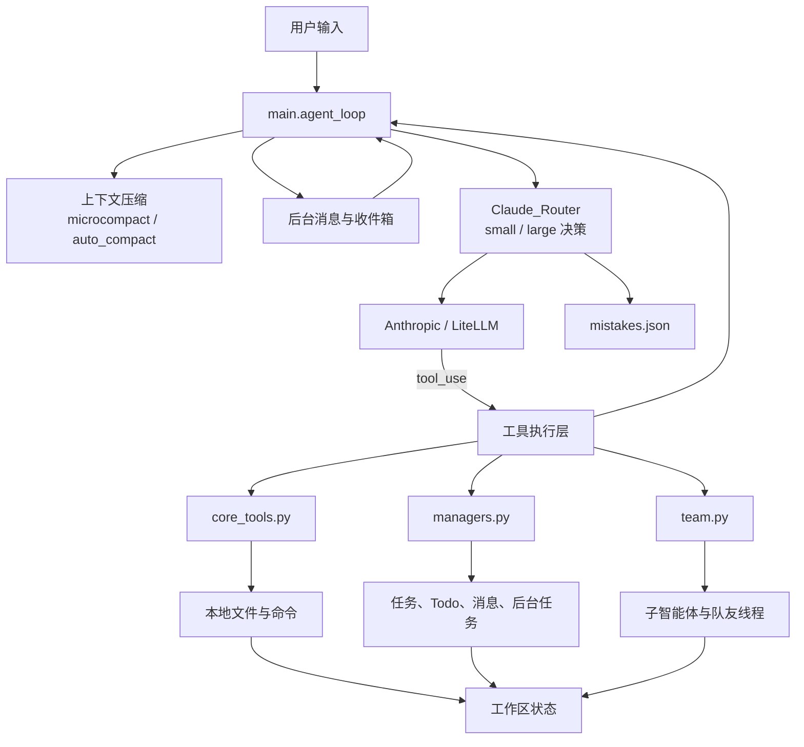
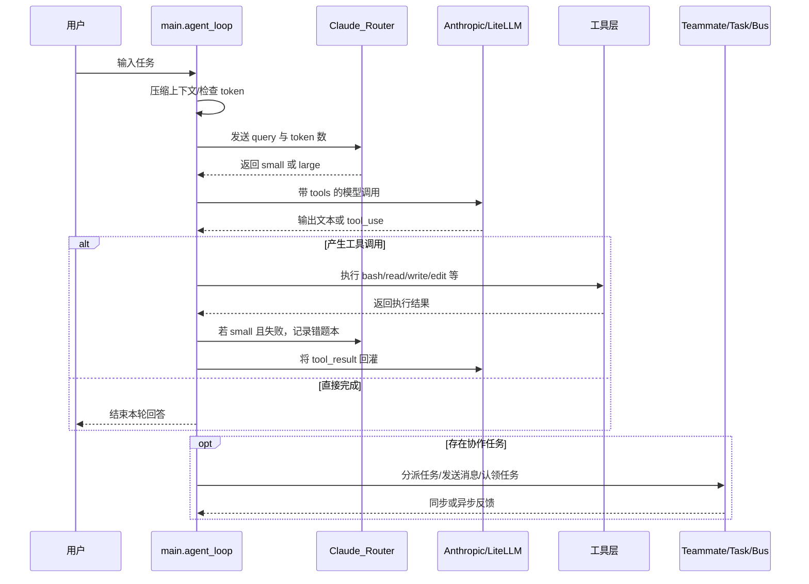

# 技术报告：自适应多智能体框架（Auto-Adaptive Agentic Framework）


## 1. 项目背景与概述

本项目源于将大模型能力工程化到生产环境时面临的现实矛盾：大型模型虽然在复杂推理与广泛任务覆盖上表现优异，但其高调用成本、较大延迟、对带宽与隐私的要求，使得在大规模、低成本场景中难以作为默认执行引擎。
我们的目标是构建一个“成本优先、风险可控”的多智能体运行时——在语义可控的常见任务上优先使用低成本的小模型以节省资源与降低响应时间；在语义不确定、历史上曾失败或上下文复杂度较高时，系统能自动、安全地升级为能力更强但代价更高的大模型以确保正确性。
为实现这一目标，项目在工程层面实现了轻量语义路由（预计算种子向量并进行在线嵌入匹配）、错题本失败记忆（将小模型的工具执行失败向量化并持久化）、以及基于会话长度的动态阈值惩罚和可配置的模型映射。这样的设计既能显著减少不必要的大模型调用与响应延迟，又通过针对性记忆与动态保守策略，在遇到已知陷阱或长期上下文膨胀时提供自动防护，从而在成本、性能与可靠性之间建立可控且可度量的折中。

主要代码文件：
- [config.py](config.py)：系统配置与 `Claude_Router` 实例化。
- [router.py](router.py)：路由器核心逻辑（语义匹配、错题拦截、动态 Token 惩罚）。
- [main.py](main.py)：主循环、工具集（TOOLS）与 Agent 调度。
- [team.py](team.py)：Teammate 和 Subagent 管理、上下文压缩逻辑。
- [core_tools.py](core_tools.py)：本地命令读写与错误判定函数。
- [managers.py](managers.py)：任务管理、消息总线、Todo 与技能加载等管理器实现。
- [requirements.txt](requirements.txt)：依赖清单。

## 2. 项目基线与创新

**基线（来源：learn_claude_code）**
- 路由与工具式 ReAct 主循环：项目继承 `learn_claude_code` 的 ReAct 风格主循环与工具调用模式（见 [main.py](main.py) 的 `agent_loop`）。
- 工具契约与本地文件工具：基础工具集（`run_bash`、`run_read`、`run_write`、`run_edit`）及其错误约定（`is_tool_error`）来源于基线实现，并在 [core_tools.py](core_tools.py) 中实现。
- 持久化目录与任务存储：任务以 `task_{id}.json`、队友配置与消息队列以 JSON/JSONL 文件保存（`TaskManager`、`MessageBus` 的文件语义与 `learn_claude_code` 保持一致）。
- 上下文压缩流水线：`microcompact(messages)` 与 `auto_compact(messages)` 的基本压缩思路与流程（写 transcript、用大模型生成摘要并替换历史消息）来自基线实现，代码在 [team.py](team.py) 与 [main.py](main.py) 中使用相同的触发与替换语义。
- 多智能体管控基础：长期驻留队友（Teammate）与短生命周期子智能体（Subagent）、`MessageBus` 的文件化 inbox 语义、以及 `BackgroundManager` 的后台任务与通知模型均为基线能力，项目在 [team.py](team.py) 与 [managers.py](managers.py) 中对这些能力做了工程化应用。

**创新**

- 微观/宏观双轨路由器 `Claude_Router`（[router.py](router.py)）
	- 目的：在运行时根据语义匹配、历史失败与上下文规模自动选择 `small` 或 `large` 模型，最大化使用低成本小模型同时在风险场景保证正确性。
	- 实现要点：预计算路由种子向量并缓存（`route_embeddings`）、对查询做在线向量化匹配、结合 `mistake_book` 与动态 token 惩罚计算最终决策；当嵌入不可用或 `force_large` 为真时保守回退为 `large`。
	- 意义：显著降低对大模型的调用次数（成本与延迟），同时通过精细化判定降低小模型误判带来的失败风险，适合工程化部署场景。

- 错题本（mistake book）（[router.py](router.py) 的 `record_mistake` 与 `_load_mistakes`）
	- 目的：捕捉并记忆小模型在工具执行时的失败上下文与向量表示，防止系统在后续相似查询上重复犯相同错误。
	- 实现要点：在小模型触发 `is_tool_error` 时获取查询向量并追加写入 JSONL（超限时覆盖重写），路由阶段线性扫描并用余弦相似度短路到 `large`。
	- 意义：提高系统可靠性与任务成功率，减少由于重复错误导致的人工干预与系统回滚成本；使得升级模型的触发更具针对性而非盲目升阶。

- 动态 Token 惩罚与长期上下文衰减（[router.py](router.py) 参数与逻辑）
	- 目的：当对话/上下文变长时，适当提高小模型被判定为可行的相似度阈值，避免在长上下文中误判小模型能胜任复杂推理或状态管理任务。
	- 实现要点：根据 `total_tokens`、`safe_tokens`、`penalty_step` 与 `penalty_rate` 计算 `dynamic_threshold`，并在 `best_route=='small'` 时用其替代静态阈值以决定是否仍选小模型。
	- 意义：在成本与正确性之间建立可控权衡；减少因历史上下文累积导致的小模型错误，提升系统在长期会话/任务中的稳定性。

- 工程化的模型映射与可配置调度（[config.py](config.py), [litellm_config.yaml](litellm_config.yaml)）
	- 目的：把模型选择与底层提供者（LiteLLM/Anthropic/本地代理）解耦，使小/大模型映射可通过配置调整而无需改动路由器代码。
	- 实现要点：通过 [config.py](config.py) 与 [litellm_config.yaml](litellm_config.yaml) 的映射关系，[main.py](main.py) / [team.py](team.py) 在调用时以 `ROUTER` 的决策结果选择对应模型名称并传递给客户端调用层。
	- 意义：便于在不同部署环境下切换模型、快速做 A/B 或成本策略调整，提高系统的可运维性与可迁移性。


## 3. 系统架构总览

本项目的架构可以概括为“一个主控入口 + 一个语义路由器 + 多类执行单元 + 多种持久化管理器”的组合。系统并不是把所有能力都塞进一个单体循环，而是把职责拆分为若干层：配置层负责环境与目录初始化，路由层负责模型选择，执行层负责工具调用与子智能体协作，管理层负责任务、消息、技能与后台任务，持久化层负责把运行状态落盘，确保系统可以在中断后继续工作。

从运行顺序上看，启动时先由 [config.py](config.py) 读取环境变量并创建全局对象，包括 Anthropic 客户端、工作目录和各类存储目录，同时实例化 `Claude_Router`。随后 [main.py](main.py) 创建 Todo、Skill、Task、Background、MessageBus 和 TeammateManager 等全局管理器，并把这些组件组装进主循环 `agent_loop`。当用户在终端输入任务后，主循环会先压缩历史上下文、再读取后台消息和收件箱、再调用路由器决定本轮使用 `small` 还是 `large`，最后把消息与工具列表一起交给大模型推理。如果模型产生工具调用，主循环会执行对应工具，再把结果回灌给模型，形成典型的 ReAct 闭环。

系统内部的核心数据流是单向推进、局部回写的：用户输入进入消息队列后，先被估算 token，再被路由决策；模型输出若触发工具执行，则通过 [core_tools.py](core_tools.py) 的本地命令与读写函数、[managers.py](managers.py) 的任务/消息/后台管理器、[team.py](team.py) 的子智能体与队友线程进行处理；执行结果会作为 `tool_result` 再次写回 messages。与此同时，任务文件、消息队列、队友配置、转录记录和错题本也会分别落在 `.tasks`、`.team/inbox`、`.team/config.json`、`.transcripts` 和 `mistakes.json` 中，保证系统的状态不是只存在于内存里。

整体模块关系如下：



从设计目标上看，这一架构的重点不是“功能堆叠”，而是把高频、低风险、低成本任务尽量放到小模型和本地工具上，把高风险、语义复杂、上下文膨胀的任务自动升级到大模型。也就是说，模型选择不是硬编码的全局常量，而是运行时动态决策的结果。


## 4. 交互流程

系统的交互流程可以分成“用户主循环”“模型工具回路”“多智能体协作回路”三层来看。

首先是用户主循环。用户在终端中输入任务后，[main.py](main.py) 会把输入追加进 `history`，然后进入 `agent_loop(history, query)`。进入主循环后，系统先执行 `microcompact(messages)`，对过长的工具结果做轻量清理；再通过 `estimate_tokens(messages)` 判断是否超过 `TOKEN_THRESHOLD`，若超阈值则触发 `auto_compact(messages)`，把历史对话写入 `.transcripts` 并生成摘要替换原上下文。这样做的目的，是避免上下文无限膨胀拖慢推理，也避免模型在长对话里遗忘前文约束。

其次是路由与模型调用。主循环会先从 Todo 列表里寻找当前正在进行或待处理的子任务，如果有，就优先把这个任务内容作为 `routing_query`；如果没有，则直接使用用户原始 query。接着调用 `ROUTER.route(...)`，路由器会结合语义种子向量、错题本与 token 惩罚来决定返回 `small` 还是 `large`。这一决策发生在每轮 LLM 调用之前，因此它不是事后纠错，而是前置分流。

模型返回后，流程进入工具执行回路。若 `response.stop_reason != "tool_use"`，说明模型直接完成了回答，主循环退出；若模型要求调用工具，则会遍历 `response.content` 中的每个 tool block，查找 `TOOL_HANDLERS` 里的对应函数并执行。执行完毕后，输出会被包装成 `tool_result` 再次送回模型，驱动下一轮推理。这个闭环与标准 ReAct 机制一致：模型先决定动作，工具返回观察结果，再由模型基于观察结果继续决策。

第三层是多智能体协作流程。系统不仅有主脑，还可以通过 `task` 工具创建子智能体，通过 `spawn_teammate` 创建长期驻留队友。子智能体适合隔离探索、快速调研或并行试验；队友则适合长期持久工作，能够通过 MessageBus 收发消息、通过任务管理器认领任务，并在空闲时进入 idle/poll 状态等待下一次唤醒。主脑可以使用 `broadcast` 向所有队友发消息，也可以通过 `shutdown_request` 让指定队友退出，形成明确的生命周期管理。

一个典型的交互顺序如下：



这个流程的关键特征是“可回路、可分支、可持久化”。一方面它允许单轮任务快速完成，另一方面也允许任务在多轮、多角色之间传递，并且每个关键节点都有文件化状态支撑，不依赖进程内瞬时变量。


## 5. 各模块运作原理

### 5.1 `config.py`：运行环境与全局对象初始化

[config.py](config.py) 的实现原则是“先建立可预测的运行边界，再让其他模块共享这套边界”。它通过 `load_dotenv(override=True)` 读取环境变量，并在检测到 `ANTHROPIC_BASE_URL` 时主动清理 `ANTHROPIC_AUTH_TOKEN`，避免本地代理和云端凭证互相冲突。`WORKDIR = Path.cwd()` 之后，所有目录都以当前工作区为根节点派生，包括 `.team`、`.tasks`、`.transcripts`、`skills` 等路径；这保证了文件读写、任务落盘和转录保存都发生在同一个沙箱内。

代码层面的关键点是，这里提前构造了两个全局对象：`Anthropic(base_url=...)` 和 `Claude_Router()`。前者决定了后续所有 `client.messages.create(...)` 调用都走同一条 API 入口，后者则在进程启动时就完成路由种子向量的预计算。换句话说，config 层并不参与业务判断，但它把“连接方式”和“持久化位置”一次性固定下来，后续模块只需要引用这些常量即可。

### 5.2 `router.py`：语义路由、错题本与动态阈值

[router.py](router.py) 的核心实现是一个三段式决策器：先做错题本拦截，再做语义相似度匹配，最后做 token 惩罚修正。初始化时，类里先写死两组种子短语，分别代表低风险任务和高风险任务，然后对每条种子文本调用本地嵌入接口 `http://localhost:11434/api/embeddings` 生成向量并缓存到 `route_embeddings`。这样做的好处是，运行时只需要对用户 query 计算一次 embedding，后面就可以直接和缓存向量做余弦相似度比对，不必每次都重新构造路由知识库。

`_get_embedding(text)` 的实现是一次简单的 HTTP POST 请求，失败时直接返回空列表；而 `route(...)` 会把这个失败视为保守信号，直接回退到 `large`。这是一种典型的 fail-safe 逻辑：向量不可用时宁可升大模型，也不把任务误派给小模型。

具体路由时，算法顺序如下。第一步，如果 `force_large` 为真，立刻返回 `large`，这给外部调用者一个硬性覆盖口。第二步，对 query 做向量化，并逐条扫描 `mistake_book`，用 `_cosine_similarity` 计算 query 与历史失败向量的夹角相似度；只要任意一条大于 `mistake_threshold`，就立即升级到 `large`。第三步，把 query 向量与 `route_embeddings` 中的所有候选向量做余弦相似度比较，保留最高分 `highest_score` 和对应路由 `best_route`。如果最佳路由本身是 `large`，或者 `highest_score` 没超过基础阈值 `threshold`，也直接返回 `large`。

只有当 best_route 是 small 且基础分数过线时，系统才进入动态惩罚阶段。这里的惩罚不是重新训练模型，而是修改决策阈值：先用 `total_tokens - safe_tokens` 计算超额 token 数，再除以 `penalty_step` 得到阶梯数 `extra_steps`，最后乘以 `penalty_rate` 形成 penalty，并把 `dynamic_threshold` 上调到 `threshold + penalty`，上限封顶 0.99。也就是说，上下文越长，小模型需要更高的语义匹配分数才能被继续放行。

`record_mistake(query)` 体现的是一个带容量上限的 FIFO 错题本。函数先把失败 query 向量化，组装成 `{query, vector}` 记录，再判断 `mistake_book` 是否超过 `max_mistakes`。如果超过，就先 `pop(0)` 删掉最老记录，再把整个列表以写覆盖方式重写回 JSONL 文件；如果没超过，就直接以追加模式写入。这个设计避免了每次写入都重刷全文件，同时保证错题本只保留最近且最有价值的失败样本。

### 5.3 `main.py`：主循环、工具分发与总控逻辑

[main.py](main.py) 的实现逻辑可以拆成“初始化管理器、准备工具表、运行 ReAct 闭环”三部分。文件开头先创建 `TODO`、`SKILLS`、`TASK_MGR`、`BG`、`BUS`、`TEAM` 这些全局实例，等于把待办、技能、任务、后台任务、消息和队友状态全部挂到同一个运行时里。随后构造 `SYSTEM` 提示词，把技能摘要通过字符串拼接注入模型上下文，这样模型在推理时可以直接看到当前可用能力。

`TOOLS` 和 `TOOL_HANDLERS` 是主循环的两个关键表。`TOOLS` 定义了工具 schema，告诉大模型每个工具的名字、输入字段和约束；`TOOL_HANDLERS` 则把工具名映射到实际 Python 函数。真正执行时，模型先返回 tool_use block，主循环再根据 `block.name` 从 `TOOL_HANDLERS` 取处理函数，最终把输出包装成 `tool_result` 送回模型。这个“模型提议动作、代码执行动作、结果回灌”的回路，就是标准的 ReAct 控制逻辑。

`agent_loop` 内部还有三段很具体的控制逻辑。第一段是上下文控制：每轮先跑 `microcompact(messages)`，再用 `estimate_tokens(messages)` 判断是否超过 `TOKEN_THRESHOLD`，超过后立刻调用 `auto_compact(messages)` 生成摘要替换历史消息。第二段是路由控制：它不是直接拿用户 query 去路由，而是优先查看 `TODO.items`，如果存在 `in_progress` 任务，就用任务内容作为 `routing_query`；否则才回退到原始 query。第三段是失败回写：只要本轮模型是 `small`，且某个工具输出被 `is_tool_error` 判定为失败，就把当前任务语义和失败工具名拼成 `mistake_context`，再交给 `ROUTER.record_mistake(...)` 写入错题本。

REPL 部分的 `/compact`、`/tasks`、`/team`、`/inbox` 命令，本质上是对内存状态和文件状态的直接读操作，不经过模型推理，因此非常适合做人工排查和调试入口。

### 5.4 `core_tools.py`：安全的本地执行层

[core_tools.py](core_tools.py) 的实现原则是“只做可控的本地执行，不做开放式系统调用”。`safe_path(p)` 先把相对路径拼到 `WORKDIR` 下，再调用 `resolve()`，最后用 `is_relative_to(WORKDIR)` 校验路径没有逃逸工作区；这一步直接把工具读写限制在项目目录里，避免越权访问。

`run_bash(command)` 的逻辑也比较明确。它先做危险字符串黑名单过滤，只要命中 `rm -rf /`、`sudo`、`shutdown`、`reboot`、`> /dev/` 这类模式就直接返回错误文本，不再调用子进程。对于普通命令，则使用 `subprocess.run(..., shell=True, cwd=WORKDIR, capture_output=True, text=True, timeout=120)` 执行，并把 stdout 和 stderr 合并。若返回码不为 0，会额外区分探测型命令：`grep`、`diff`、`cmp` 返回码为 1 时视为正常探测结果，而不是错误；其他非 0 情况统一包装成 `Error: Bash exit code ...`。这等于把“探测失败”和“真正执行失败”区分开来，减少误报。

`run_read`、`run_write`、`run_edit` 分别对应读取、创建/覆盖写入和单次替换写入。它们都通过 `safe_path` 获得目标路径，然后做 `read_text()`、`write_text()` 或字符串替换，最后返回可读文本结果。`estimate_tokens(messages)` 不是真实 tokenizer，而是用 `len(json.dumps(messages, default=str)) // 4` 做粗估，因此它属于轻量控制阈值，不追求绝对精度。`microcompact(messages)` 则遍历 messages，找到历史里所有 `tool_result`，只对过长内容做就地裁剪为 `[cleared]`，保留结构但压缩体积。`is_tool_error` 则负责统一错误前缀判断，供主循环和子智能体复用。

### 5.5 `managers.py`：任务、技能、后台与消息管理

[managers.py](managers.py) 的实现重点是把多个“状态型功能”拆成独立管理器，并用文件、线程和队列把它们串起来。`TodoManager.update(items)` 先逐项校验 content、status 和 activeForm，限制 status 只能是 pending、in_progress、completed，并且用计数器确保同时只有一个 in_progress。也就是说，这个类不是简单保存列表，而是在写入时强制执行任务流约束。

`SkillLoader` 则是一个面向目录的解析器。它遍历 skills 目录下所有的 SKILL.md 文件，读取文本后先尝试用 front matter 解析元信息，再把解析出的 meta 和 body 存入内存字典。实现上它不是做复杂的 YAML 解析，而是用一个简单的正则把首尾的分隔区间切出来，再逐行按冒号分割键值，因此对技能文件格式的要求比较稳定：前面放元信息，后面放正文。`load(name)` 则直接把 body 包装成 skill 标签字符串返回，方便主模型把技能内容原样注入上下文。

`TaskManager` 使用文件系统作为任务数据库。`create(subject, description)` 会先通过扫描 `task_*.json` 计算下一个 id，再把任务写成 JSON 文件；`get` 读取单个任务文件；`update` 负责维护状态、依赖和删除逻辑。这里最关键的逻辑是依赖关系：当某个任务完成时，代码会遍历所有 task 文件，检查是否有其他任务的 blockedBy 包含当前任务 id，如果有就移除该依赖。这样一来，任务完成会自动解锁后续任务，避免人工同步依赖状态。

`BackgroundManager` 的实现是典型的线程加队列模型。`run(command, timeout)` 会先分配一个 UUID 作为任务 id，把任务状态写入内存字典，然后启动 daemon 线程执行 `_exec`。`_exec` 内部用 `subprocess.run(..., shell=True, cwd=WORKDIR, capture_output=True, text=True, timeout=timeout)` 运行命令，并把结果截断后写入 `self.tasks` 和 `notifications` 队列。主线程通过 `drain()` 一次性取走通知，因此后台任务不会阻塞主对话循环。

`MessageBus` 则是基于 inbox 文件的轻量消息总线。`send` 不是把消息放入数据库，而是直接把 JSON 序列化后 append 到对应接收者的 JSONL 文件；`read_inbox(name)` 读取整份文件，解析完后立即清空，这相当于实现了“消费即删除”的收件箱语义。`broadcast` 只是对所有队友名字循环调用 `send`，因此它的复杂度完全由队友数量决定，逻辑非常直接。

### 5.6 `team.py`：子智能体与持久化队友

[team.py](team.py) 的核心逻辑分成两部分：子智能体执行和长期队友管理。

`run_subagent(prompt, agent_type)` 是一个短生命周期执行器。它先根据 agent_type 构造工具集合，默认只开放 bash 和 read_file；如果不是 Explore，还会额外开放写文件和编辑文件。然后它创建一段只包含用户 prompt 的消息序列，在最多 30 轮里反复调用模型、执行工具、回灌结果。每一轮都会先用 ROUTER.route(query=prompt, total_tokens=...) 决定用 small 还是 large，这意味着子智能体也继承了同一套语义路由策略。若某次工具输出被判定为错误且当前模型是 small，就立刻把 prompt 和失败工具名写入错题本，确保子智能体踩过的坑会被全局记住。

`TeammateManager` 则是持久化协作的核心。`spawn(name, role, prompt)` 会先检查同名队友是否已经存在，如果存在且状态不是 idle 或 shutdown，就直接拒绝重复启动；如果可以复用，就更新角色并把状态改成 working。随后它启动一个后台线程执行 `_loop(name, role, prompt)`，让队友独立运行。这个设计的重点不是并发数量，而是队友状态可恢复：配置文件保存在 .team/config.json 中，因此即使主进程退出，队友列表和状态仍然可以在下次启动时恢复。

在 `_loop` 内部，队友的行为是一个“工作阶段 + 空闲阶段”的循环。工作阶段里，线程先轮询自己的 inbox，读到 shutdown_request 就立即退出；如果收到普通消息，就把消息包装成 `<inbox>...</inbox>` 形式追加到上下文。随后它会从最近的消息里提炼 mission：如果遇到 `<auto-claimed>`，说明任务来自任务板；如果遇到 `<inbox>`，则尝试把 JSON 解析出来并使用消息 content 作为当前 mission。接着它调用 ROUTER.route 选择模型，再让模型带着本地工具继续执行。

空闲阶段里，队友会先把状态切成 idle，再按 POLL_INTERVAL 轮询 inbox 和任务目录。若 inbox 里出现新消息，就恢复工作；若任务目录里出现未认领且没有 blockedBy 的任务，就自动 claim，并把任务写回上下文作为 `<auto-claimed>`。如果长时间都没有新消息和新任务，就把状态切成 shutdown 并退出线程。为了避免压缩上下文后丢失身份信息，当 messages 变得很短时，代码还会重新注入 `<identity>` 片段，把 name、role 和 team_name 放回上下文，保证队友始终知道自己是谁。

### 5.7 模块之间的协同关系

这些模块之间是串联关系，不是平铺关系。`config.py` 负责提供统一的工作区和客户端入口，`router.py` 负责在调用模型之前做分流判断，`main.py` 负责维持主闭环和错误回写，`core_tools.py` 负责安全执行本地命令和文件操作，`managers.py` 负责任务、技能、消息和后台状态，`team.py` 负责把同一套路由和工具逻辑扩展到子智能体与长期队友。这样的分层让系统既能保持单进程的可控性，又能表现出多智能体系统的协作能力。

## 6. 数据流与持久化

- 持久化目录由 [config.py](config.py) 定义，包含 `.team`、`.tasks`、`.transcripts` 等子目录；系统通过这些目录保存运行时状态以便重启恢复。
- 错题本默认文件 `mistakes.json`，采用 JSONL 格式（每行为一个 JSON 对象，包含 `query` 与 `vector` 字段），写入采用追加或在超限时覆盖重写的策略。
- 任务与队友配置以 `task_{id}.json`、`team/config.json` 等 JSON 文件保存在对应子目录，程序启动时会读取这些文件恢复任务板与队友状态；写入异常会记录日志但不会抛出未处理异常。

## 7. 部署与运行

依赖（见 [requirements.txt](requirements.txt)）：`anthropic`, `python-dotenv`, `pyyaml`, `litellm[proxy]`。

推荐运行步骤：
1. 安装依赖：

```bash
pip install -r requirements.txt
```

2. 启动本地向量服务（如 Ollama），并确保嵌入 API 可达。
3. 配置 `litellm_config.yaml` 将 `small`/`large` 映射到实际模型。参考 [README.md](README.md) 的示例。
4. 启动 LiteLLM 代理（可选）：`litellm --config litellm_config.yaml --port 4000`。
5. 设置环境变量（`.env`），然后运行主程序：

```bash
python main.py
```

## 8. 性能优化与扩展性设计

### 8.1 性能优化

本项目的性能优化重点不是追求单次模型推理极限，而是通过“少调用、少等待、少回退”的方式降低系统整体响应时间和资源占用。

- 路由前置预计算：`Claude_Router` 在启动阶段就完成路由种子向量的预计算，运行时只需对当前 query 做一次嵌入并进行余弦匹配，避免重复构建路由知识库。
- 上下文压缩减负：`microcompact(messages)` 会先裁剪冗长的工具输出，`auto_compact(messages)` 会在 token 超阈值时生成摘要并替换历史上下文，减少长会话对模型推理速度和内存压力的影响。
- 保守升级策略：当嵌入服务失败、错题本命中或上下文过长时，系统直接升级到大模型，不在低质量输入上反复重试，从而减少无效请求和额外等待。
- 本地执行超时控制：`run_bash` 统一设置超时并限制危险命令，后台任务通过独立线程执行并截断输出，避免长时间阻塞主循环。
- 持久化协作解耦：任务、消息、队友状态分别落在独立文件中，主循环不需要持有所有协作状态的锁，降低了同步开销。

### 8.2 可扩展性（Scalability）

这个框架的扩展性主要体现在三个层面：

- 新接入 LLM：模型能力与底层提供方通过 `config.py` 和 `litellm_config.yaml` 解耦，只要在 LiteLLM 里增加新的 `model_name` 映射，主流程就可以复用同一套路由与工具调用逻辑。
- 新增自定义插件：工具系统采用 `TOOLS` + `TOOL_HANDLERS` 的注册模式，新增工具只需补充 schema 和处理函数，不需要重写主循环。
- 多智能体协同：`team.py` 已经把短生命周期子智能体和长期驻留队友拆开，消息总线、任务管理器和后台任务管理器也都是独立模块，因此后续可以继续扩展专用角色、并行分工和任务接力机制。

## 9. 安全性、鲁棒性与限制

- 安全：
	- `run_bash` 的实现位于 [core_tools.py](core_tools.py)。当命令字符串包含任一危险子串（如 "rm -rf /", "sudo", "shutdown", "reboot", "> /dev/"）时，函数直接返回 `Error: Dangerous command blocked`，不会调用子进程。
	- 对正常执行的命令，使用 `subprocess.run(..., timeout=120)` 执行；将 `stdout` 与 `stderr` 合并后最多截断为 50000 字符返回；当无输出时返回 `(no output)`。
	- 对于 `grep`、`diff`、`cmp` 此类探测型工具，若返回码为 1（常表示未找到匹配或存在差异），实现会视为正常探测结果并返回非错误文本而非 `Error:` 前缀输出。

- 鲁棒性：
	- 路由器在 [router.py](router.py) 中通过 `_get_embedding` 调用本地嵌入服务（默认 `http://localhost:11434/api/embeddings`）。当嵌入请求超时或失败时，`_get_embedding` 返回空向量，`route(...)` 在此情况下保守地返回 `large`。
	- 错题本以 JSONL 格式持久化（默认文件名 `mistakes.json`），由 `Claude_Router.record_mistake` 追加写入；当条目数超过 `max_mistakes`（默认 200）时，最早条目会被移除并触发覆盖式重写以持久化删除。

- 限制：
	- 向量匹配目前通过线性扫描对 `route_embeddings` 与 `mistake_book` 逐条计算余弦相似度，未集成专用近似最近邻索引（如 FAISS/annoy）。在错题本或种子向量规模较大时，查询复杂度为 O(n)，可能成为性能瓶颈。
	- `estimate_tokens(messages)` 使用 `len(json.dumps(messages, default=str)) // 4` 作为简化估算，非基于真实 tokenizer 计数，可能导致触发压缩的阈值与实际 token 使用存在偏差。

## 10. 结论

该框架实现了在工程化场景下平衡成本与可靠性的实践：以轻量向量检索为核心判断依据，辅以错题本与上下文衰减惩罚，能够在多数常规任务中优先选择小模型以节约成本，同时在潜在高风险情形下自动切换到大模型保证正确性。

当前仓库已经补充了开源协议与协作规范文件，分别是 [LICENSE](LICENSE) 和 [CONTRIBUTING.md](CONTRIBUTING.md)。

---
